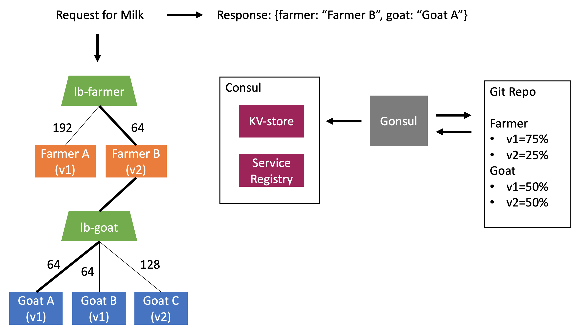

## "Goat Milk?" Dairy Farm
* [High-Level Architecture](#0)
* [Project Overview](#1)
* [Implementation](#2)
* [Deployment Pipeline Features](#3)
* [Load Balancing Implementation Patterns](#4)
   * [Populating the service registry](#4-1)
   * [Populating routing rules](#4-2)
   * [Location of load balancing decision](#4-3)
* [Implementation Patterns of Well-Known Tools](#5)
   * [Kubernetes](#5-1)
   * [Istio](#5-2)
   * [Netflix Eureka + Ribbon](#5-3)
   * [HA-Proxy + Consul + consul-template (this project)](#5-4)
* [Build and Run the Dairy Farm](#6)
    * [System Requirements](#6-0)
    * [Build Images](#6-1)
    * [Set Environment Variables](#6-2)
    * [Gonsul Setup: Use a local file or Connect to a remote repo with ssh](#6-3)
    * [Run Infrastructure and Application Instances](#6-4)
    * [Send a Request for Milk](#6-5)
    * [View Running Instances in a Web Browser](#6-6)
    * [Modify Routing Weights for Service Versions](#6-7)


## High-Level Architecture <a name="0"></a>




## Project Overview <a name="1"></a>

The goal of this project was to learn more about load balancing tools for rolling deployments (blue-green and canary).

The project implements a dairy farm that produces bottles of milk. Each incoming request for milk is received by a farmer, who milks a goat, then returns a milk bottle labeled with the farmer and goat that serviced the request. 

The labels on each milk bottle will change as requests are loadbalanced across the various farmer and goat instances. The labels are also important because the "Goat Milk?" Dairy Farm brand is all about that farm-to-table.

The diary farm has multiple instances of farmers and goats, each with a service name and version number. Ex: farmer-v1, goat-v1, goat-v2. 

Internal load balancing is implemented to allow service-level canary deployments by service name and version. A routing weight can be assigned to each service-version pair (ex. route 80% of traffic to v1 goats and 20% to v2 goats). The routing rules in each load balancer are automically updated when weights change and services scale up/down.

For example, introducing a new goat is easy: start the goat with the new version number and update the service-version routing weight to a non-zero percentage. To stop routing traffic to all services of a specific version, set the service-version routing weight to zero.

The dairy farm uses load balancing tools that can all be run in a non-orchestrated and non-cloud environment. 

This makes it easy to: test the tools, get a feel for the concepts, and see what additional functionality is desired in a full deployment pipeline.

Check out the section on "Deployment Pipeline Features" to see what's included in the diary farm implementation and what's missing.


## Implementation <a name="2"></a>

* A load balancer for service-level, canary deployments by service name and version.
* Routing is implemented using server-side load balancing with one load balancer per service cluster.
* Routing rules are updated in real-time using information stored in consul: service registrations and traffic weights.
* HA-Proxy load balancers access information in consul and populate routing rules using consul-template.
* Traffic weights are stored in a git repository and synced to the consul kv-store in real-time using gonsul.
* HA-Proxy hot reload and consul-template polling allow routing rules to be updated automatically without dropping existing traffic.
* Side-car containers register each load balancer with consul. As a result, the load balancer address is flexible and client-side load balancing can be implemented to support redundant load balncers for each service.
* This load balancing implementation attempts to externalize all routing logic from the application services (hence the use of server-side load balancing).

Note: There are pros and cons to each load balancing implementation pattern. See the section "Load Balancing Implementation Patterns" for the key elements of load balancing, examples from well-known tools, and the pattern used by this dairy farm.

## Deployment Pipeline Features <a name="3"></a>

Ideally, everything in this list would be automated - even the commits to git which update the deployment config!
Automation and resource management is where cloud native pipelines and orchestration tools really come in handy.

| Deployment Feature | Implementation Status    |
| :---               | :---                     |
| Provision new instances and start/stop running apps       | Manual    |
| Test the newly provisioned services                       | Manual    |
| Update deployment config in version control               | Manual    |
| Update routing based on deployment config and app status  | Automated |
| Single environment view of apps and infrastructure         | Automated<sup>1</sup> |
| Database migration on upgrade or rollback                 | Missing<sup>2</sup>   |

1. All parts of the application are not registered with consul: goats, farmers and LBs are registered, but gonsul is not.
2. Apps in the dairy farm are simple and don't have any data storage.

Note on Data Migration: 
* Data migration may need downtime and definitely needs separate tooling.
* If API changes are not backwards compatible, then you might not be able to have two versions of the app running at once.
* In this case, you need blue-green and can't go with canary.


## Load Balancing Implementation Patterns <a name="4"></a>

Definition: Load balancing - balancing traffic across a set of resources.

Load balancing implementations can be characterized by three key elements:
1. Populating the service registry
   * What resources are available?
2. Populating the routing rules
   * Which resource should be served next?
3. Location of the load balancing decision
   * Where is the load balancing decision made? (server-side or client-side)

Implementation options for each load balancing element:

#### 1. Populating the service registry <a name="4-1"></a>
 * Smart orchestrator, simple clients
     - orchestrator keeps track of where it deploys client apps, checks up on their health, and updates the service registry
 * Simple orchestrator, smart clients
     - orchestrator deploys and forgets; client apps and the service registry monitor health and update registrations

#### 2. Populating routing rules <a name="4-2"></a>
 * Locally sourced
     - rules generated by load balancing host
 * Externally sourced
     - rules served from an api to the load balancing host

#### 3. Location of load balancing decision (where to send the request) <a name="4-3"></a>
 * Server-side load balancing
     - decision made by a load balancing server
 * Client-side load balancing
     - decision can be made in app or in side-car

Existing load balancing implementations exhibit some combination of these elements.


## Implementation Patterns of Well-Known Tools (and this project) <a name="5"></a>

#### Kubernetes <a name="5-1"></a>
1. Populate service registry
    - **Smart orchestrator, simple clients**
        (kubernetes populates IP tables for the services it deploys)
2. Populate routing rules
    - **Locally sourced rules**
        (kubernetes uses round-robin for each service based on IP tables)
3. Location of load balancing decision
    - **Server-side**
        (resolves service name using IP tables - clients are unaware of load balancing)

#### Istio <a name="5-2"></a>
1. Populate service registry
    - **Smart orchestrator, simple clients**
        (Envoy side-car proxy deployed alongside each app instance; Istio control plane monitors the health of each instance-proxy pair)
2. Populate routing rules
    - **Externally sourced rules**
        (Istio control plane serves rules to Envoy side-cars through Envoy management API)
3. Location of load balancing decision
    - **Client-side (in side-car)**
        (Envoy side-car proxy routes traffic from the service)

#### Netflix Eureka + Ribbon <a name="5-3"></a>
1. Populate service registry
    - **Simple orchestrator, smart clients**
        (client apps register and report health to the eureka server)
2. Populate routing rules
    - **Either: Locally out-of-the-box, but external is possible if you provide the api**
        (app uses the Ribbon client to query eureka and select a service instance, selection and query logic can be customized with app code)
3. Location of load balancing decision
    - **Client-side (in app)**
        (app choses a service based on selection logic in the Ribbon client)

#### HA-Proxy + Consul + consul-template (this project) <a name="5-4"></a>
1. Populate service registry
    - **Simple orchestrator, smart clients**
        (client apps register and provide a health check endpoint for consul to monitor their status)
2. Populate routing rules
    - **Locally sourced rules**
        (the template used to create routing rules is part of the load balancer image)
3. Location of load balancing decision
    - **Server-side**
        (routing decision is made by the HA-Proxy instance sitting in front of the service cluster)


## Build and Run the Dairy Farm <a name="6"></a>

#### 0. System Requirements <a name="6-0"></a>

* Unix-based OS (for bash/shell scripts)
* Docker
* Java (version between 8 and 14 inclusive).

#### 1. Build Images <a name="6-1"></a>

Pull the consul image:
```
$ docker pull consul
```

Build the docker images for the load balancer: (haproxy, registrator, gonsul)
```
$ cd loadbalancer && ./build.sh && cd ..
```

Build the images for the goat and farmer applications: (Requires a Java version between 8 and 14 for Gradle)
```
$ cd goat && ./docker-build.sh && cd ..
$ cd farmer && ./docker-build.sh && cd ..
```

#### 2. Set Environment Variables <a name="6-2"></a>

Set environment variables for your local machine:
* In ./loadbalancer/.env, replace "your-host-ip" with the ip address of your machine:
ex. if your host IP is 10.0.0.20
```
CONSUL_ADDR=10.0.0.20:8500
HOST_IP=10.0.0.20
```
* Optionally modify ports for the farmer/goat load balancers (haproxy instances) and gonsul.


#### 3. Gonsul Setup: Use a local directoy or Connect to a remote repo with ssh <a name="6-3"></a>

As currently configured, gonsul reads service-weights from files in a directory on the github repo of this project.
Gonsul accesses the files by cloning the repo over ssh. The gonsul image created for this project requires 
an ssh key that is NOT password protected to be bindmounted into the container. 

If the host user's private ssh key (~/ssh/id_rsa) is password protected, then do one of the following:

**Option 1: Point gonsul at a local directory (removing the need for ssh)**

Gonsul can also be configured to use a local directory instead of a remote url. See gonsul docs for details: https://github.com/miniclip/gonsul#--repo-url

To do this, you'll need to make two small modifications to the gonsul service in ./loadbalancer/docker-compose-run.yml:
1. Remove the --repo-url arg
* Note: This tells gonsul to look in the local file system at /--repo-root/--repo-base-path. For the current values in the .yml file, gonsul will look for values in /home/gonsul/tmp/loadbalancer/kvstore.
2. Add a bindmount for the ./loadbalancer/kvstore directory to the directory specified by the combintation of --repo-root and --repo-base-path:
```
volumes:
    - type: bind
      source: ./kvstore
      target: /home/gonsul/tmp/loadbalancer/kvstore
```   
* Note: The bindmount makes the local kvstore files available at the proper location in the container. Docker bindmounts sync changes between the host and container, so the container will see any changes we make on the host. Therefore, gonsul will see any changes to the routing weight files on the host.

**Option 2: Use an ssh key that is not password protected**
1. If all ssh keys on the host are password protected, then create an ssh key that is not password protected.
2. Add the public key of the non-password protected ssh key to the user's github account.
3. Update the gonsul configuration to use the non-password protected ssh-key: change the value of --repo-ssh-key
to use the private key file of the non-password protected key. (ex. --repo-ssh-key=/home/gonsul/.ssh/private-key-without-password).

#### 4. Run Infrastructure and Application Instances <a name="6-4"></a>

Run infrastructure images for the dairy farm: (specified in ./loadbalancer/docker-compose-run.yml)
* Note: The apps will take a second to start. To see the logs for all apps as they start, execute run without the daemon argument: ./run.sh
```
$ cd loadbalancer && ./run.sh -d && cd ..
```

Run some goats and farmers: (as many as you like, just vary the port and version number)
* If you are running the apps on host 10.0.0.20 and consul on 10.0.0.20:8500, then you can try something like the following:
```
$ cd goat
$ ./docker-run.sh -p 8101 -v 0.0.1 -h 10.0.0.20 -ch 10.0.0.20:8500
$ ./docker-run.sh -p 8102 -v 0.0.2 -h 10.0.0.20 -ch 10.0.0.20:8500
$ cd ..

$ cd farmer
$ ./docker-run.sh -p 8111 -v 0.0.1 -h 10.0.0.20 -ch 10.0.0.20:8500
$ ./docker-run.sh -p 8112 -v 0.0.2 -h 10.0.0.20 -ch 10.0.0.20:8500
$ cd ..
```

#### 5. Send a Request for Milk <a name="6-5"></a>

Send a milk request to the farmer load balancer:
ex. If a farmer haproxy instance is running on port 8212:
```
$ curl -s "http://localhost:8212/milk"
```
Note: The farmer and goat will change as milk requests are load balanced across application instances.

#### 6. View Running Instances in a Web Browser <a name="6-6"></a>

View registered services and key-value store in consul:
* If consul is running on your local host at port 8500:
```
http://localhost:8500
```

View stats dashboard for haproxy instances:
* If an haproxy instance is running on your local host with stats port 8414: (refer to the port values in ./loadbalancer/.env or the port mappings of the running containers)
```
http://localhost:8414/monitor
```

#### 7. Modify Routing Weights for Service Versions <a name="6-7"></a>

Note: The service-version values will be synced to the kv-store and used to compute new routing weights for the associated load balancers. After modifying the service-version values, view the resulting changes in the consul UI (kv-store values) and the haproxy stats UI (computed routing weights for each load balancer). See the section "View Running Instances in a Web Browser" for how to access each UI in a web browser.

**Option 1: Modify the local file (use if gonsul reads a local directory)**
1. Edit values in ./loadbalancer/kvstore/farmer.json or ./loadbalancer/kvstore/goat.json

**Option 2: Fork and commit (use if gonsul connects to a remote repo)**
1. Fork the repo
2. Update the CONFIG_REPO_URL in ./loadbalancer/.env to the ssh url of your fork
3. Stop and restart gonsul with the new config
```
$ docker ps -a | grep gonsul | cut -d " " -f 1 | xargs docker stop
$ cd loadbalancer && ./run.sh -d gonsul && cd ..
```
4. Clone the fork
5. Edit values in ./loadbalancer/kvstore/farmer.json or ./loadbalancer/kvstore/goat.json
6. Commit and push the change to the master branch of the fork
7. Repeat steps 5 and 6 for subsequent changes 
